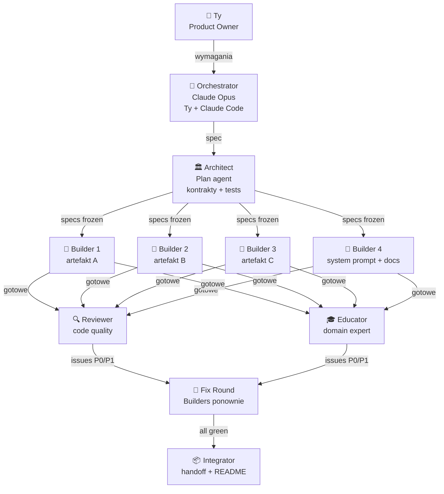

# 🎯 Playbook — replikuj ten projekt dla swojego repo

> Jak zbudować edukacyjny system (3-4 artefakty + Claude Project + GitHub Pages) używając **9 agentów AI** w metodologii **Spec-Driven TDD** — z gotowymi promptami i checklistami.

**Co dostajesz:** Krok po kroku jak zaadaptować podejście użyte w tym repo do dowolnego innego tematu (matura z polskiego, biologii, prawa jazdy, certyfikaty zawodowe, kursy językowe, etc.).

**Czas:** 1 dzień intensywnej pracy z Claude Code (~$50-200 w tokenach).

**Stack:** Claude Code/Cowork + Claude Pro + GitHub.

---

## 📚 Dlaczego ten playbook (research-backed)

### Spec-Driven Development to standard 2026

Spec-driven development (SDD) zamienia specyfikacje z biernej dokumentacji w wykonywalne kontrakty, które ograniczają to, co AI agenty generują. SDD jest wszędzie w 2026 — **GitHub Spec Kit ma 72k+ gwiazdek**, AWS zbudował IDE Kiro wokół tej koncepcji. ([InfoQ: Spec Driven Development](https://www.infoq.com/articles/spec-driven-development/))

### Multi-agent przewyższa pojedynczego agenta o 90%

Anthropic odkrył: system z Claude Opus 4 jako orchestrator + Sonnet 4 subagenty pokonuje pojedynczego agenta o **>90%** w internal evals. Przewaga wynika z możliwości rozłożenia rozumowania na niezależne okna kontekstu. ([Anthropic: Multi-Agent Research System](https://www.anthropic.com/engineering/multi-agent-research-system))

### TDD wymaga osobnych kontekstów

Gdy wszystko działa w jednym oknie kontekstu, LLM **nie może prawdziwie podążać za TDD** — analiza twórcy testów wycieka do myślenia implementatora. ([alexop.dev — Forcing Claude to TDD](https://alexop.dev/posts/custom-tdd-workflow-claude-code-vue/))

### Cost reality check

Multi-agenty zużywają **~15× więcej tokenów** niż zwykły chat. Sensowne tylko gdy wartość zadania uzasadnia koszt. ([Anthropic 2026 Agentic Coding Report](https://resources.anthropic.com/2026-agentic-coding-trends-report))

> **Wniosek dla Ciebie:** Jeśli budujesz produkt edukacyjny lub komercyjne narzędzie — multi-agent z SDD się opłaca. Jeśli to skrypt na 10 linii — overkill.

---

## 🏗️ Architektura zespołu agentów



### 9 ról

| # | Rola | Tool | Output |
|---|---|---|---|
| 0 | **Orchestrator** (Ty) | Claude Code | Cele, decyzje, kierunek |
| 1 | **Architect** | Plan agent | `Architecture.md`, schemas, tests |
| 2-5 | **Builders** × 4 | general-purpose | Artefakty, kod |
| 6 | **Reviewer** | general-purpose | Issues techniczne (P0/P1/P2) |
| 7 | **Domain Expert** | general-purpose | Issues merytoryczne |
| 8 | **Integrator** | general-purpose | README, INSTALACJA, handoff |

---

## 🚀 5-fazowy proces (gotowe prompty)

### FAZA 0 — Wstępne planowanie (Ty + Claude w czacie, 30 min)

**Prompt do Claude Pro:**

```
Chcę zbudować [TYP_PRODUKTU] dla [GRUPA_DOCELOWA] — pomóż mi zaplanować.

Kontekst:
- Cel: [np. przygotowanie do egzaminu X]
- Użytkownicy: [profil, liczba, level techniczny]
- Czas do deadline: [np. 30 dni]
- Budżet: [Claude Pro $20/mies, GitHub free, czas X godzin]
- Konkurencja: [istniejące rozwiązania jakie znam]

Pytania do mnie (na każde po 1 zdaniu odpowiedzi):
1. Jakie są 3 największe pain pointy mojej grupy docelowej?
2. Jakie 3-5 funkcji dadzą 80% wartości (Pareto)?
3. Czy potrzebuję offline (localStorage) czy cloud sync (window.storage)?
4. Czy to ma być web-first, mobile-first, czy desktop?
5. Jaki jest minimalny viable test dla success?

Wynik: rozmowa, którą skończymy "OK, idę do Fazy 1 — Architect".
```

**Output Fazy 0:** krótki dokument `BRIEF.md` (200-500 słów) — najważniejsze decyzje produktu.

---

### FAZA 1 — Architect (1 agent, 30-60 min)

**Prompt do Plan agent:**

```
Jesteś Agent-Architect w zespole budującym [PRODUKT] dla [GRUPA].

Kontekst (z BRIEF.md): [wklej]

Twoje zadanie: Zaprojektuj kontrakty i strukturę aby N builderów
mogło pracować równolegle bez konfliktów.

Wymagane outputy w `<workspace>/Architecture.md`:

1. JSON Schemas — wszystkie struktury danych z przykładami
2. API contracts — funkcje JS, format eksportu, storage keys
3. Design system — kolory (HEX, WCAG AA), typografia, spacing
4. Konwencje — i18n, format dat, notacja matematyczna/etc
5. Struktura plików — drzewo katalogów
6. TDD test scenarios — 10-15 per artefakt z priority P0/P1/P2
7. Komunikacja inter-agent — strefy odpowiedzialności (no-conflict)
8. ADRs (Architecture Decision Records) — uzasadnienia kluczowych wyborów
9. Ryzyka przed Fazą 2 — co może pójść źle

Najpierw przeczytaj:
- BRIEF.md
- [istniejące dokumenty domain knowledge]

Odpowiedz mi (max 300 słów):
- Link do Architecture.md
- TL;DR 5 kluczowych decyzji
- Ryzyka

Nie piszesz kodu artefaktów — tylko specyfikacje.
```

**Output Fazy 1:**
- `Architecture.md` (1000-3000 słów)
- `contracts/schemas.json` (JSON Schema draft 2020-12)
- `contracts/design-tokens.json`
- `tests/<artefakt>.test.md` × N (Given/When/Then, P0/P1/P2)

> **Critical:** schemas freeze po fazie 1. Zmiany = bump v2 (nowy storage key).

---

### FAZA 2 — Builders (N agentów RÓWNOLEGLE, 30-90 min każdy)

**Kluczowe:** spawn wszystkich w jednej wiadomości (równolegle = oszczędność czasu).

**Template prompt do każdego Buildera:**

````
Jesteś Builder-[NAZWA] w zespole budującym [PRODUKT].

Twoje zadanie: Zbuduj plik `[artefakt].html` (single-file, CDN libs)
działający jako Claude.ai Published Artifact + GitHub Pages.

KROK 1 — przeczytaj (obowiązkowo):
- Architecture.md
- contracts/schemas.json
- contracts/design-tokens.json
- tests/[artefakt].test.md (wszystkie P0 muszą przejść)

KROK 2 — zbuduj artefakt do `artifacts/[artefakt].html`

Specyfikacja:
[lista funkcji 1-15]

CDN allowed:
[Tylko whitelisted libs — KaTeX, MathLive, React UMD, etc.]

Wymagania krytyczne:
- Storage adapter: window.storage → localStorage → in-memory fallback
- BRAK localStorage/sessionStorage poza adapterem
- Limit X linii / Y KB
- Single .html file
- Dostępność WCAG AA

KROK 3 — Self-test:
Po zapisaniu uruchom mentalnie wszystkie P0 testy.
Jeśli któryś nie przejdzie — napraw.

Raport końcowy (max 300 słów):
- Ścieżka, linie, rozmiar
- P0 status ✅/❌ (lista)
- P1 status (cel ≥80%)
- Znane ograniczenia
- Otwarte pytania do Architect

Pracuj dokładnie — Reviewer cię przejrzy.
````

**Output Fazy 2:** N artefaktów + system prompt (jeśli aplikuje).

**Token cost:** ~3-5k tokens per builder (4 builders ≈ 15-20k tokens).

**Pułapki obserwowane w sesji:**
- Socket disconnect przy długich agentach (>5 min) — recovery: pisz pliki bezpośrednio Edit/Write
- Builder może podać "self-checked ✅" mimo bugów — Phase 3 to wyłapie

---

### FAZA 3 — Reviewers (2 agentów RÓWNOLEGLE, 30-60 min)

**Reviewer Techniczny:**

````
Jesteś Reviewer. Peer review N artefaktów + system promptu.

KROK 1 — czytanie:
[wszystkie pliki z Fazy 1 + 2]

KROK 2 — review pod kątem:
1. Zgodność z testami P0/P1 (manualny trace przez kod)
2. Zgodność z kontraktami (schemas, design-tokens)
3. Bugi: race conditions, memory leaks, off-by-one
4. Performance: re-renders, lazy loading
5. Accessibility: ARIA, keyboard, focus, touch ≥44px
6. Mobile: viewport <375px, touch events
7. Edge cases (lista z BRIEF/Architecture)
8. Bezpieczeństwo: XSS, walidacja
9. Code quality: duplikacja, magic numbers

KROK 3 — utwórz `reviews/review-<artefakt>.md`:
Format:
```markdown
## Issue #N — P0/P1/P2 — kategoria — tytuł
Test: [ID]
Linia: ~funcName/ (245-260)
Obserwacja: opis
Oczekiwane: jak powinno być
Sugestia fix: kod
Owner: Builder-X
```

Priority: P0=blocker, P1=fix ≤24h, P2=nice-to-have

Raport końcowy (max 500 słów):
- Sumaryczne issues per artefakt
- TOP 5 najbardziej krytycznych
- Czy production-ready bez fixes?
````

**Reviewer Domain Expert (np. Educator dla edu, Lawyer dla legal, Doctor dla medical):**

```
Jesteś Domain Expert. Review merytoryczny.

KROK 1 — czytanie:
- Cała domain content (curriculum, normy, wzory, etc.)
- Wszystkie pliki z Fazy 2

KROK 2 — sprawdź:
1. Merytoryka — sprawdź min. 10 wybranych elementów
2. Konwencje branżowe (np. polskie CKE, ISO 27001, etc.)
3. Pareto — czy priorytety są rzetelne
4. Mnemotechniki/triki — poprawne i zapamiętywalne
5. Evidence-based methods — czy prompt używa znanych technik
6. Ton — czy odpowiedni dla audience
7. Pułapki domenowe — czy user jest na nie przygotowany
8. Bank zadań/treści — pokrycie i jakość

KROK 3 — utwórz `reviews/pedagogy-<artefakt>.md`
Format jak Reviewer techniczny + sekcja "Issues merytoryczne"

WAŻNE: każdy P0 błąd merytoryczny = stracone punkty/pieniądze użytkownika.
Bądź srogi.
```

**Output Fazy 3:** raporty z konkretnymi issues, każdy z P0/P1/P2 priority i propozycją fix.

---

### FAZA 4 — Fix Round (N Builders RÓWNOLEGLE, 30-60 min)

**Prompt do każdego Buildera (ten sam co Faza 2 + dopisek):**

```
Jesteś Builder-[NAZWA] (Fix Round).

KROK 1 — przeczytaj raport: `reviews/review-<artefakt>.md`

KROK 2 — napraw artefakt:
- WSZYSTKIE P0 (must-fix przed publikacją)
- WSZYSTKIE P1 (cel: ≥80%)
- P2 jeśli czas pozwala

Zasady:
- Nie psuj testów które przechodziły
- Jeśli fix wymaga zmiany kontraktu — flag jako "needs Architect"
- Backward compatibility ze storage key
- Limit linii / rozmiaru

KROK 3 — Self-test wszystkich P0/P1.

Raport (max 200 słów):
- Lista naprawionych
- Lista nie-naprawionych z uzasadnieniem
- Czy któryś P0 wciąż failuje?
```

**Output Fazy 4:** czysty kod, P0=100%, P1≥80%.

---

### FAZA 5 — Integrator (1 agent + Ty, 30-60 min)

**Prompt:**

```
Jesteś Integrator.

KROK 1 — weryfikacja:
- Wszystkie pliki istnieją
- JSON walidne
- Wszystkie testy P0 przeszły
- Brak orphan referencji

KROK 2 — utwórz pliki dla użytkownika końcowego:
- README.md (GitHub-style, badge'y, scenariusze użycia, macierz funkcji)
- INSTALACJA.md (krok-po-kroku dla NIE-technicznego)
- CLAUDE.md (instrukcje dla Claude Code/Cowork)
- SETUP.md (deploy GitHub Pages, fork workflow)
- CONTRIBUTING.md (jak dodawać treść, PR workflow)
- LICENSE (MIT)
- .gitignore
- .github/workflows/deploy.yml (auto-deploy GitHub Pages)

KROK 3 — landing page `docs/index.html`:
- Hero + 3 cards z artefaktami
- Tech badges
- Footer z safety hotline jeśli edu

Raport: lista plików, status, link do README.
```

---

## 📋 Checklist replikacji (kopiuj do swojego projektu)

### Pre-flight (przed startem)

- [ ] Mam Claude Pro lub większy
- [ ] Mam Claude Code lub Cowork zainstalowany
- [ ] Mam konto GitHub
- [ ] Mam ~$50-200 budżetu na tokeny (multi-agent kosztuje)
- [ ] Wiem **kogo** mój produkt obsłuży i **jakie pain pointy** rozwiązuje
- [ ] Znam top 3-5 funkcji (Pareto)

### Faza 0: Brief (30 min)

- [ ] BRIEF.md napisany (max 500 słów)
- [ ] Decyzje: web/mobile/desktop, online/offline, single/multi-user
- [ ] Lista istniejących rozwiązań (szukaj na GitHub awesome-lists)

### Faza 1: Architecture (60 min)

- [ ] `Architecture.md` z 9 sekcjami
- [ ] `contracts/schemas.json` (JSON Schema draft 2020-12)
- [ ] `contracts/design-tokens.json`
- [ ] `tests/*.test.md` × N (P0/P1/P2)
- [ ] Strefy odpowiedzialności jasne (no-conflict per file)

### Faza 2: Build (parallel, 60-90 min)

- [ ] N artefaktów w `artifacts/`
- [ ] System prompt + domain docs (jeśli edu)
- [ ] Każdy Builder zwrócił raport z P0 status
- [ ] **Storage adapter** w każdym artefakcie (window.storage → localStorage → memory)

### Faza 3: Review (parallel, 60 min)

- [ ] `reviews/review-*.md` (techniczny)
- [ ] `reviews/pedagogy-*.md` (domain)
- [ ] Każdy issue ma: priority + lokalizacja + fix
- [ ] Lista TOP issues przygotowana

### Faza 4: Fix (parallel, 60 min)

- [ ] WSZYSTKIE P0 fixed (sprawdź re-test)
- [ ] ≥80% P1 fixed
- [ ] Builder raporty potwierdzają fixes

### Faza 5: Integration (60 min)

- [ ] README.md z badge'ami i scenariuszami użycia
- [ ] CLAUDE.md w roocie (Claude Code auto-load)
- [ ] INSTALACJA.md dla nie-tech userów
- [ ] SETUP.md dla devów
- [ ] `.github/workflows/deploy.yml`
- [ ] LICENSE + .gitignore
- [ ] `docs/index.html` jako landing
- [ ] Walidacja: `python3 -c "import json; json.load(open('FILE'))"`

### Deploy (15 min)

- [ ] `git init && git add . && git commit -m "Initial"`
- [ ] `gh repo create NAME --public --source=. --push`
- [ ] `gh repo edit --enable-pages --pages-branch main --pages-path /docs`
- [ ] Po 2 min sprawdź `https://USER.github.io/NAME/`
- [ ] Test scenariusza 1 (online) na świeżej przeglądarce
- [ ] Test scenariusza 2 (clone) lokalnie

---

## 🎓 Best practices (co warto wiedzieć)

### CLAUDE.md powinno mieć **<60 linii**

> Jeśli twój CLAUDE.md ma ponad 80 linii, Claude **zaczyna ignorować jego części**. HumanLayer trzyma swoje pod 60 linii. ([abhishekray07/claude-md-templates](https://github.com/abhishekray07/claude-md-templates))

**Anti-pattern:** CLAUDE.md w tym repo ma ~150 linii. Powinien być splittowany na **Skills** (loadowane on-demand) i **Rules** (path-scoped).

### Skills > CLAUDE.md dla domain knowledge

> CLAUDE.md ładowany **co sesję**. Skills ładowane **on-demand**. Domain knowledge → Skills (folder `.claude/skills/`).

### TDD wymaga osobnych kontekstów

> W jednym oknie kontekstu LLM **nie może podążać za TDD** — analiza testów wycieka do implementacji. **Rozwiązanie:** oddzielny agent dla testów, oddzielny dla implementacji. ([alexop.dev](https://alexop.dev/posts/custom-tdd-workflow-claude-code-vue/))

### 6 elementów dobrego specu

1. **Outcomes** (co osiągamy)
2. **Scope boundaries** (co NIE jest w zakresie)
3. **Constraints** (techniczne, biznesowe, prawne)
4. **Prior decisions** (ADRs)
5. **Task breakdown** (konkretne deliverables)
6. **Verification criteria** (jak sprawdzimy że działa)

### Hooks w Claude Code

> **PostToolUse hook** — auto-uruchom testy po każdej zmianie pliku. Klucz do prawdziwego TDD. ([code.claude.com/docs/best-practices](https://code.claude.com/docs/en/best-practices))

---

## 🛠️ Gotowe biblioteki agentów (zamiast budować od zera)

Sprawdź te repozytoria — może masz gotowe agenty dla swojego use case:

| Repo | Co | Liczba agentów |
|---|---|---|
| [VoltAgent/awesome-claude-code-subagents](https://github.com/VoltAgent/awesome-claude-code-subagents) | Production-ready subagenty | 100+ |
| [wshobson/agents](https://github.com/wshobson/agents) | Multi-agent orchestrators + skills + commands | 184 agentów |
| [0xfurai/claude-code-subagents](https://github.com/0xfurai/claude-code-subagents) | Specialized devs | 100+ |
| [hesreallyhim/awesome-claude-code](https://github.com/hesreallyhim/awesome-claude-code) | Curated lista skills, hooks, plugins | meta |
| [ChrisWiles/claude-code-showcase](https://github.com/ChrisWiles/claude-code-showcase) | Comprehensive config example | demo |

### Templates CLAUDE.md i konfiguracji

| Repo | Co |
|---|---|
| [abhishekray07/claude-md-templates](https://github.com/abhishekray07/claude-md-templates) | Stack-specific templates (Go, Rust, Rails, Django) |
| [shanraisshan/claude-code-best-practice](https://github.com/shanraisshan/claude-code-best-practice) | Reference implementation patterns |
| [davila7/claude-code-templates](https://github.com/davila7/claude-code-templates) | CLI tool do konfigurowania Claude Code |
| [pedrohcgs/claude-code-my-workflow](https://github.com/pedrohcgs/claude-code-my-workflow) | Academic LaTeX/Beamer + R z multi-agent review |

### Spec-Driven Development tools

| Tool | Co | Stars |
|---|---|---|
| [GitHub Spec Kit](https://developer.microsoft.com/blog/spec-driven-development-spec-kit) | Microsoft/GitHub open-source SDD toolkit | 72k+ |
| AWS Kiro IDE | IDE dedykowane SDD | (komercyjne) |

---

## 💡 Lessons learned (z tej konkretnej sesji)

### Co działało

- **Plan agent dla architektury** — jeden agent w trybie read-only zaprojektował kontrakty, builderzy ich przestrzegali
- **Parallel builders** — 4 agenty w jednej wiadomości = ~3-4× szybciej niż sekwencyjnie
- **Peer review jako osobni agenci** — Reviewer + Educator złapali 7 P0 + 31 P1 których builderzy nie zobaczyli
- **TDD scenarios w Markdown** — tańsze niż Playwright, łatwiejsze do peer review

### Co się popsuło

- **Socket disconnect** dla długich agentów (Builder-Project, Builder-Project-Continuation) — straciłem ~30 min czasu, recovery: pisanie plików bezpośrednio (Edit/Write)
- **CLAUDE.md za długi** (>150 linii) — należało splitować na Skills
- **Storage adapter dodany dopiero w Fazie 5** — powinien być w Architecture (Faza 1) — kosztowało extra fix round
- **Test SR-05 niezgodny z impl** — test pisany przez Architect nie pokrywał się z formułą Anki SM-2 — needed reconciliation

### Pułapki do uniknięcia w Twoim projekcie

1. **Spec freeze po Fazie 1** — żadnych zmian schemas bez bump v2
2. **Strefa odpowiedzialności jednego writera** per plik — żadnych konfliktów
3. **Storage adapter od razu** — `window.storage` → `localStorage` → `memory` (3 fallbacki)
4. **Limit linii artefaktu** ścisły (~3000 dla Claude.ai)
5. **CDN whitelist** — sprawdź co Cowork artifacts pozwalają (Chart.js, Grid.js, Mermaid only)
6. **Real device testing** — emulator ≠ telefon

---

## 💰 Estymacja kosztów

| Komponent | Ilość | Tokens (~) | Koszt @ Claude Opus 4.6 |
|---|---|---|---|
| Architect (Plan) | 1× | 50k input + 30k output | ~$2-5 |
| Builders (general-purpose) | 4× | 60k input + 80k output each | ~$15-25 |
| Reviewer + Educator | 2× | 100k input + 30k output each | ~$8-15 |
| Fix Round | 4× | 30k input + 30k output each | ~$5-10 |
| Integrator | 1× | 30k input + 20k output | ~$2-3 |
| **Razem** | | ~700k tokens | **~$30-60** |

**+ Twoje konwersacje z Claude Code:** 2-4h chat = ~$20-40

**Razem:** **~$50-100** dla projektu wielkości matury.

> ⚠️ Multi-agenty zużywają ~15× więcej tokenów niż chat ([Anthropic](https://www.anthropic.com/engineering/multi-agent-research-system)). Dla małych projektów (script <100 linii) — overkill.

---

## 🎯 Kiedy używać tego playbooka

### ✅ Dobre case'y

- Edukacja (matura, certyfikaty, kursy językowe)
- Onboarding/training material
- Compliance tools (GDPR, ISO checklists)
- Konfiguratory produktów
- Symulatory (egzamin, rozmowa kwalifikacyjna)
- Personal productivity tools

### ❌ Złe case'y

- Skrypty <100 linii (overkill, użyj zwykłego chatu)
- Real-time apps (artefakty są stateless między sessions)
- Heavy backend (artefakty = frontend-only)
- Multi-user collaboration (każdy ma swój state)
- Compliance gdzie ważna audytowalność (LLM nondeterministic)

---

## 🚀 Quick start template

Skopiuj tę strukturę do nowego repo:

```
my-project/
├── BRIEF.md                       # Faza 0
├── Architecture.md                # Faza 1
├── contracts/
│   ├── schemas.json
│   └── design-tokens.json
├── tests/
│   └── <artefakt>.test.md         # Faza 1, P0/P1/P2
├── artifacts/                      # Faza 2 — buildery tu piszą
│   └── <artefakt>.html
├── claude-project/                 # Faza 2 — system prompt + docs
│   ├── system-prompt.md
│   ├── INSTALACJA.md
│   └── docs/
├── reviews/                        # Faza 3 — Reviewer + Educator
│   ├── review-<artefakt>.md
│   └── pedagogy-<artefakt>.md
├── docs/                           # Faza 5 — GitHub Pages
│   ├── index.html
│   └── <artefakt>.html             # kopie z artifacts/
├── .github/workflows/
│   └── deploy.yml
├── README.md
├── CLAUDE.md
├── SETUP.md
├── CONTRIBUTING.md
├── LICENSE
└── .gitignore
```

**Pierwszy prompt** (Faza 0):

```
[wklej "Faza 0 prompt" z sekcji wyżej, zamień placeholdery]
```

Po Fazie 0 → idź do Fazy 1 itd.

---

## 📚 Dalsza nauka

### Anthropic resources

- [Building Effective AI Agents](https://resources.anthropic.com/building-effective-ai-agents)
- [Multi-Agent Research System (case study)](https://www.anthropic.com/engineering/multi-agent-research-system)
- [2026 Agentic Coding Trends Report](https://resources.anthropic.com/2026-agentic-coding-trends-report) (PDF)
- [Claude Code Best Practices](https://code.claude.com/docs/en/best-practices)

### Multi-agent patterns

- [5 Claude Code Agentic Workflow Patterns](https://www.mindstudio.ai/blog/claude-code-agentic-workflow-patterns) — sequential, operator, split-and-merge, agent teams, headless
- [Agent Teams Setup & Usage Guide 2026](https://claudefa.st/blog/guide/agents/agent-teams)
- [Building AI Agents with Anthropic's 6 Composable Patterns](https://aimultiple.com/building-ai-agents)

### Spec-Driven Development

- [The Architect-Builder Pattern (Waleed Kadous)](https://waleedk.medium.com/the-architect-builder-pattern-scaling-ai-development-with-spec-driven-teams-d3f094b8bdd0)
- [Spec Driven Development for Responsible AI in 2026](https://www.nvarma.com/blog/2026-03-01-spec-driven-development-claude-code/)
- [GitHub Spec Kit](https://developer.microsoft.com/blog/spec-driven-development-spec-kit)
- [InfoQ: Spec Driven Development](https://www.infoq.com/articles/spec-driven-development/)

### TDD z Claude Code

- [Forcing Claude Code to TDD: Red-Green-Refactor Loop](https://alexop.dev/posts/custom-tdd-workflow-claude-code-vue/)
- [TDD with Claude Code (claude-code-ultimate-guide)](https://github.com/FlorianBruniaux/claude-code-ultimate-guide/blob/main/guide/workflows/tdd-with-claude.md)

### Awesome lists

- [hesreallyhim/awesome-claude-code](https://github.com/hesreallyhim/awesome-claude-code)
- [VoltAgent/awesome-claude-code-subagents](https://github.com/VoltAgent/awesome-claude-code-subagents)
- [wshobson/agents](https://github.com/wshobson/agents) — 184 agentów + 16 orchestratorów

---

## 🤝 Wkład

Jeśli używasz tego playbooka:

1. ⭐ Star ten repo
2. 📝 Otwórz Issue z lessons learned z Twojego projektu
3. 🔀 PR z poprawkami / nowymi promptami
4. 💬 Podziel się wynikami w discussions

---

## 📜 License

MIT — używaj jak chcesz, dla komercyjnych i niekomercyjnych projektów.

**Powodzenia z Twoim projektem! 🚀**

---

*Ostatnia aktualizacja: 2026-04-25*
*Wersja: 1.0*
*Sesja referencyjna: matura-polski-2026 (1 dzień, 9 agentów, 5 faz, ~$80 tokens)*
